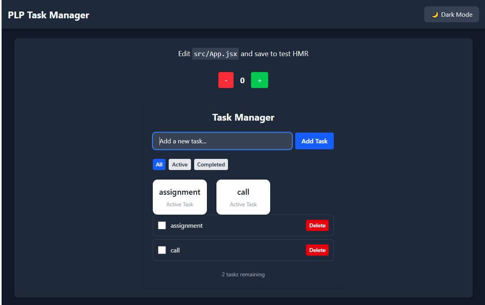
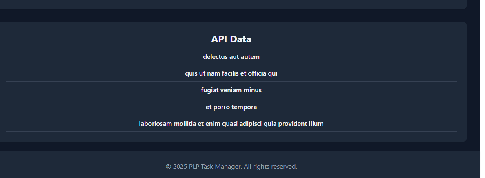

# 🌙 PLP Task Manager — React + Vite + Tailwind CSS

This project is part of the **MERN Front-End Development Assignment** focusing on mastering **React, JSX, CSS, and Tailwind**.  
It demonstrates component reusability, state management using React hooks, API integration, and a dynamic **light/dark mode** using React Context.

---

## 🚀 Features

✅ Built with **React + Vite** for fast development  
✅ Styled with **Tailwind CSS**  
✅ Theme toggling using **Context API (Dark/Light Mode)**  
✅ Task Manager with CRUD-like behavior (Add, Delete, Filter tasks)  
✅ API integration using [JSONPlaceholder](https://jsonplaceholder.typicode.com)  
✅ Reusable UI components: Button, Navbar, Footer  
✅ Responsive and accessible design

---

## 🧠 Tech Stack

| Layer | Technology |
|-------|-------------|
| Frontend | React (Vite) |
| Styling | Tailwind CSS |
| State Management | React Hooks & Context API |
| API | JSONPlaceholder (Fake API for demo) |
| Tooling | ESLint, Vite |

---

## 🧩 Project Structure

```
vite-project/
├── public/
├── src/
│   ├── components/
│   │   ├── Button.jsx
│   │   ├── Navbar.jsx
│   │   ├── Footer.jsx
│   │   └── TaskManager.jsx
│   ├── context/
│   │   └── ThemeContext.jsx
│   ├── App.jsx
│   ├── index.css
│   ├── main.jsx
│   └── App.css
├── package.json
├── vite.config.js
└── tailwind.config.js
```

---

## ⚙️ Setup Instructions

1. **Clone the project**
   ```bash
   git clone <your-repo-link>
   cd vite-project
   ```

2. **Install dependencies**
   ```bash
   npm install
   ```

3. **Run the development server**
   ```bash
   npm run dev
   ```

4. Open your browser and navigate to  
   👉 [http://localhost:5173](http://localhost:5173)

---

## 🌗 Dark & Light Mode

The app uses **React Context** to manage theme switching.  
User preference is saved to `localStorage` and applied automatically on reload.

---

## 📝 API Integration

Data is fetched from **JSONPlaceholder**:
```
https://jsonplaceholder.typicode.com/todos?_limit=5
```

Displayed as a task list under the “API Data” section.

---

## 🖼️ Screenshots




### 🪄 Dark Mode


*(If you also have a light mode screenshot, include it below:)*

### ☀️ Light Mode


---

## 🧰 Available Scripts

| Command | Description |
|----------|-------------|
| `npm run dev` | Run the development server |
| `npm run build` | Build the app for production |
| `npm run preview` | Preview the production build |

---
Images

---

## 📚 Learning Outcomes

Through this assignment, I learned to:
- Use **Vite** for fast React setup
- Create and reuse **modular React components**
- Manage state using **React Hooks**
- Implement **ThemeContext** for app-wide dark/light mode**
- Fetch and render **external API data**
- Style modern UI with **Tailwind CSS**

---

## 👨‍💻 Author

**Name:** Simon Ruto  
**Course:** PLP – Mastering Front-End Development (Week 3 Assignment)  
**Tools:** React, Vite, Tailwind CSS, Context API

---

> _“Code is like humor. When you have to explain it, it’s bad.” – Cory House_
